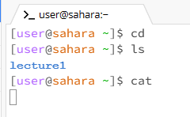
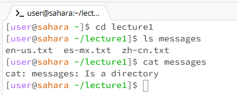
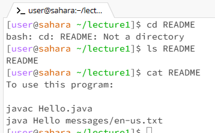

# Lab1Report

## 1.Here is an example of using command with no arguments

**the directory is:**
 /home
> "cd" means change directory, since I commanded with no argument, it will be back to the previous folder.
and directory is /Home, it won't change the directory. This isn't an error.

> "ls" means looking for the files and folders inside the current working directory,so it showed "lecture1".

> "cat" is used to show the contents of one or more files given by the paths.

## 2.Here is an example of using the command with a path to a directory as an argument.

**the directory is:**
/home/lecture1
> "cd" means change directory, since I commanded with lecture1, it will go to the path folder（/home/lecture1）.

> "ls" means looking for the files and folders inside the current working directory,so it showed "en-us.txt  es-mx.txt zh-cn.txt".

> "cat" This is an error because "messages" isn't a file, it's a directory, so it showed "Is a directory".

## 3.Here an example of using the command with a path to a file as an argument.

**the directory is:**
/home/lecture1
> "cd" means change directory, since README isn't a directory; it's a file, so it showed as "Not a directory". ---error

> "ls" means looking for the files and folders inside the current working directory,README is a file，so it showed "README".

> "cat" This is an error because "README" is a file, so it showed  the contents of the README file.
